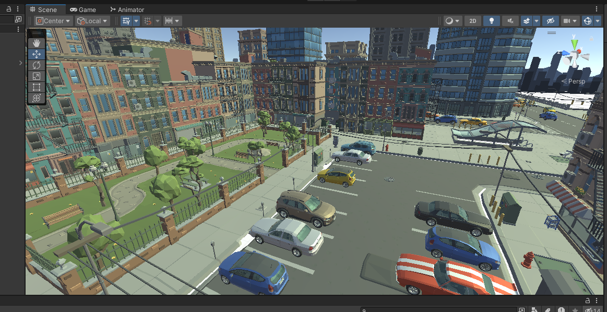
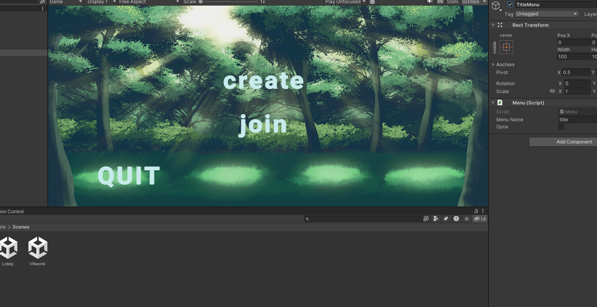
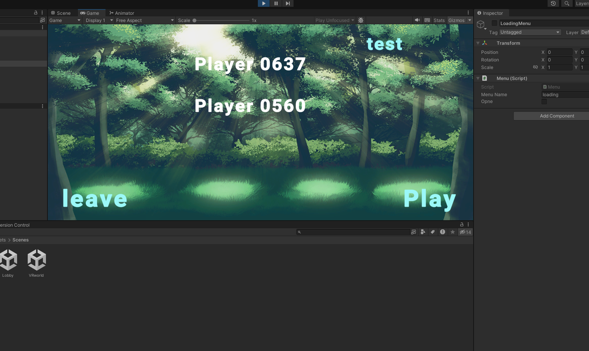

# Social Gatherings Through Virtual Reality (VR)

## Project Overview

**Social Gatherings Through Virtual Reality (VR)** is a capstone project developed by students of East West University, Bangladesh. The project explores the integration of Virtual Reality (VR) technology to enhance social interactions and gatherings, overcoming physical and geographical barriers. This solution provides users with immersive environments to connect, communicate, and collaborate virtually.

## Key Features

- **Immersive Virtual Environment**: The application offers rich, interactive 3D environments such as virtual gardens, ponds, and bridges, enhanced with day and night cycles.
  
- **Multiplayer Lobby**: Users can create or join lobbies, enabling group experiences within the VR environment.

- **Customization**: Basic avatar customization options, allowing users to personalize their appearance within the virtual space.

- **Cross-Platform Support**: The app supports both Android and iOS platforms, using Google VR and Unity Engine for optimal performance.

## How to Use

1. **Download the Application**: The app is available for both iOS and Android devices.
2. **Create a Lobby**: Launch the app, click on 'Host' to create a new lobby.
3. **Join a Lobby**: To join an existing social gathering, enter the provided lobby code.
4. **Explore the Environment**: Use the provided controls to move your avatar and interact with other users.

## Development

- **Engine**: Unity 3D
- **Programming Language**: C# (for backend and VR controls)
- **Networking**: Photon PUN for real-time multiplayer capabilities.
- **Assets**: Most 3D assets were sourced from Unity's Asset Store.

### System Design

The system utilizes Unity’s **OVRTK** VR camera and **Photon PUN** networking for multiplayer functionality. The application features smooth character movement, interactive animations, and optimized environment loading, ensuring seamless user experiences across platforms.

## Future Improvements

- Integration of advanced avatars with more expressive gestures.
- Enhanced privacy and security for virtual gatherings.
- Additional customization for environments, allowing users to create their own VR spaces.

## Limitations

- Limited support for non-verbal communication tools (haptic feedback and gestures).
- Requires a stable internet connection for optimal performance.

## Business Model

The application follows a **freemium** model:
- Free version with basic features and limited avatar customization.
- Premium version offering enhanced environments, avatars, and ad-free experiences.

## Contributors

- **Abir Hasan Khan** (2019-1-60-013)
- **Hasibul Hasem Shanto** (2019-1-60-025)
- **Md Amlan** (2019-1-60-056)
- **Humayun Rashid Rahat** (2019-1-60-007)

## Supervisor

- **Sadika Islam Sneha** - Lecturer, Department of Computer Science and Engineering, East West University.

